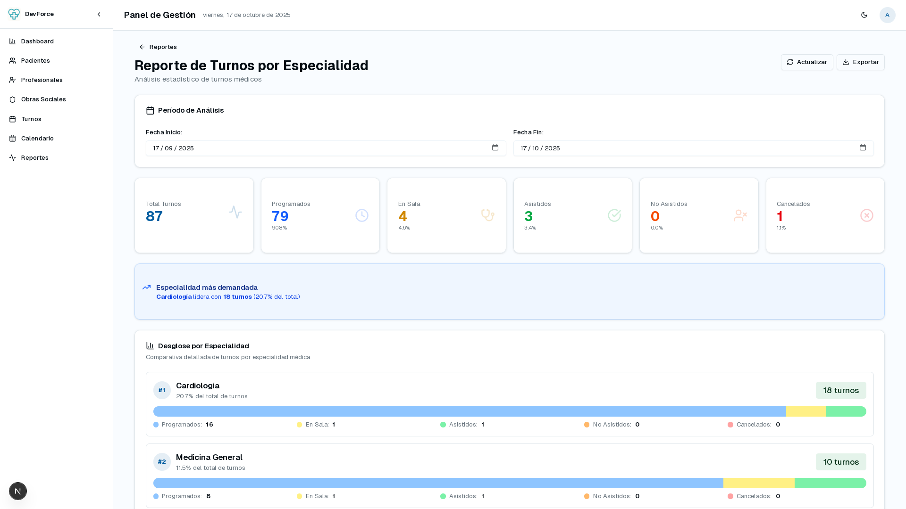

## Policonsultorio DevForce


Sistema integral para el manejo y administración de un policonsultorio. Construido utilizando
el framework web [Next.js](https://nextjs.org)

([View README in english](./README_en.md))

## Funcionalidades y características
- Administración de datos personales y de historias clínicas de pacientes.
- Consulta y carga de datos relacionados a profesionales y obras sociales.
- Administración de turnos asignados a los pacientes.
- Generación de reportes con información útil para la toma de decisiones.
- Sistema de roles que separa las funcionalidades necesarias para:
    - Gerencia
    - Mesa de entrada
    - Profesionales

## Screenshots
### Dashboard


### Página de pacientes


### Página de historias clínicas


### Página de reportes


## Dependencias
- npm
    - Typescript
    - Next.js
    - PostCSS
    - Prisma
    - Lucide-React
    - JsPDF
- Docker
    - Para base de datos PostgreSQL
    - En el caso de utilizar Windows, es necesario instalar la versión de WSL

## Instalación
Clonar el repositorio e instala las dependencias de npm
```sh
$ git clone https://github.com/nesktf/policonsultorio_devforce.git
$ cd policonsultorio_devforce/
$ npm install
```

Inicializar el container de docker para Postgres
```sh
$ docker pull postgres:15
$ docker compose up -d
```

Inicializar el schema de prisma
```sh
$ npx prisma migrate dev
$ npx prisma generate
```

Opcionalmente, llenar la base de datos con datos dummy
```sh
$ ./script/psql_exec.sh script/test_rows.sql
```

Finalmente, iniciar el servidor
```sh
$ npm run dev
```

Por defecto, la página web estará hosteada en [http://localhost:3000](http://localhost:3000)
